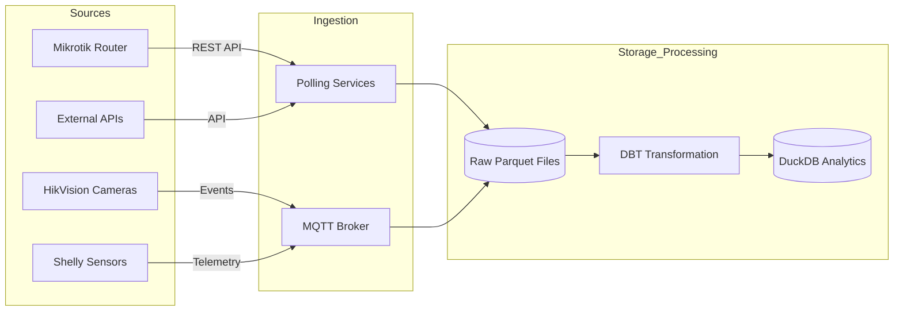
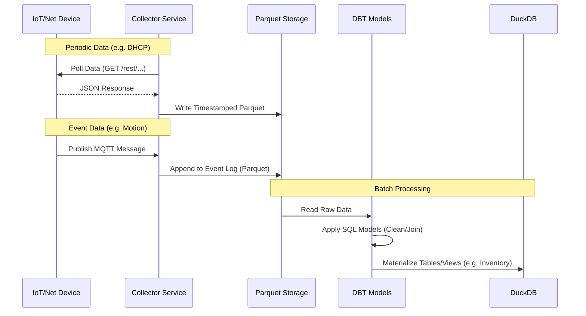

# IoT Home Automation & Analytics Platform

A comprehensive system for monitoring, managing, and analyzing a smart home/office network. This project integrates network infrastructure data (Mikrotik), IoT device telemetry (Shelly), and security feeds (HikVision) into a unified data pipeline for analytics and automation.

## Project Structure

```text
/home/gnet/iot/
├───.dockerignore          # Files excluded from Docker builds
├───.env                   # Local secrets (ignored by git)
├───.env_example           # Template for environment variables
├───.gitignore             # Git ignore rules
├───dbt_project.yml        # DBT project configuration
├───profiles.yml           # DBT connection profiles
├───debug_db.py            # Utility script for debugging DuckDB
├───homebot/               # Main Application Source Code
│   ├───app.py             # Flask API & Data Ingestion Logic
│   ├───requirements.txt   # Python dependencies
│   ├───models/            # DBT SQL Models (Data Transformations)
│   │   ├───int_shelly_metrics.sql
│   │   ├───inventory.sql
│   │   └───sources.yml
│   ├───seeds/             # Static CSV Data (e.g., Device Metadata)
│   │   └───device_metadata.csv
│   └───services/          # Integration Modules
│       └───mikrotik.py    # Mikrotik API Client
├───data/                  # Local storage for Parquet files and DuckDB
└───doc/                   # Additional Documentation
```

## Setup & Configuration

1.  **Clone the repository:**
    ```bash
    git clone <repository-url>
    cd iot
    ```

2.  **Environment Variables:**
    Copy the example configuration file and update it with your actual credentials.
    ```bash
    cp .env_example .env
    ```
    Edit `.env`:
    ```ini
    MIKROTIK_HOST=10.10.100.1
    MIKROTIK_USER=homebot
    MIKROTIK_PASSWORD=your_secure_password
    ```

## Running the Application

### Option 1: Python (Local Development)

1.  **Create and activate a virtual environment:**
    ```bash
    python3 -m venv venv
    source venv/bin/activate
    ```

2.  **Install dependencies:**
    ```bash
    pip install -r homebot/requirements.txt
    ```

3.  **Run the application:**
    ```bash
    python homebot/app.py
    ```
    The API will be available at `http://localhost:5000`.

### Option 2: Docker Compose

1.  **Build and run with Docker Compose:**
    ```bash
    docker-compose up -d --build
    ```

2.  **View logs:**
    ```bash
    docker-compose logs -f
    ```

3.  **Stop the service:**
    ```bash
    docker-compose down
    ```

## Data Processing & Analytics Pipeline

We employ a hybrid data collection strategy to handle the diverse nature of our IoT and network devices, ensuring both historical depth and real-time responsiveness.

### 1. Data Collection Strategy

The system distinguishes between data that needs to be actively polled and real-time events pushed by devices.

*   **Periodic Polling (Pull):** Used for stateful information and devices without push capabilities.
    *   *Example:* Polling Mikrotik for active DHCP leases to maintain a device inventory.
*   **Event-Driven (Push):** Used for real-time telemetry and alerts.
    *   *Example:* MQTT messages from Shelly sensors (power, temperature) or HikVision camera motion alerts.

### 2. Service Integration

We are building specialized services for data ingestion and enrichment:

*   **`services/mikrotik`:** (Active) Connects to the Mikrotik REST API to fetch DHCP leases. This data is used to resolve device MAC addresses to hostnames and IP addresses, acting as the foundation for our **Device Inventory**.
*   **Future Services:**
    *   **`hik-vision`:** For retrieving camera status and snapshots.
    *   **`weather`:** External weather API integration for correlation with internal sensors.
    *   **`geoip`:** For analyzing external traffic sources.
    *   **`cloud-screenshot-analysis`:** Triggered by motion events; uploads camera snapshots to a cloud AI service for object detection/classification.

### 3. Analytics Workflow

Our data pipeline transforms raw signals into actionable insights:

1.  **Ingestion:** Data is collected via Services (API) or MQTT Brokers.
2.  **Raw Storage:** All incoming data is first saved as **Parquet** files for efficient columnar storage and history preservation.
3.  **Manual Analytics:** Data scientists/engineers can directly query Parquet files for ad-hoc analysis.
4.  **Transformation (DBT):** We use **DBT (Data Build Tool)** to define SQL models. These models clean, deduplicate, and aggregate the raw data.
    *   *Specific Use Case:* Creating the `Inventory` table by combining Mikrotik DHCP data with static device metadata.
5.  **Data Warehouse (DuckDB):** The processed models are loaded into **DuckDB** for high-performance analytical querying and dashboarding.

### 4. Architecture Diagrams

#### High-Level Data Flow



#### Detailed Processing Logic



### 5. Step-by-Step Implementation Example

This outlines the practical execution flow for our core use case—managing device inventory and collecting power metrics.

1.  **Fetch Device Data (Source):** The `mikrotik` service queries the router's DHCP server to get a list of all currently assigned IP addresses and associated MAC addresses.
2.  **Build Inventory (Transformation):** We create an `inventory` table. This is done by joining the live DHCP data with a static `device_metadata.csv` seed file (containing owner, location, device type). This gives us a trusted list of *what* is on the network.
3.  **Targeted Polling (Enrichment):** The system uses the `inventory` table to identify active Shelly devices. It then specifically polls these IP addresses to get detailed status (power usage, temperature, relay state).
4.  **Persist Data (Storage):** The results of these polls are immediately written to local disk as time-partitioned **Parquet** files (e.g., `data/shelly_raw.parquet`).
5.  **Analytics (Aggregation):** Finally, DBT runs scheduled transformations to read the Parquet files, aggregate the metrics (e.g., "Daily Power Consumption by Room"), and load the clean results into **DuckDB** for visualization.