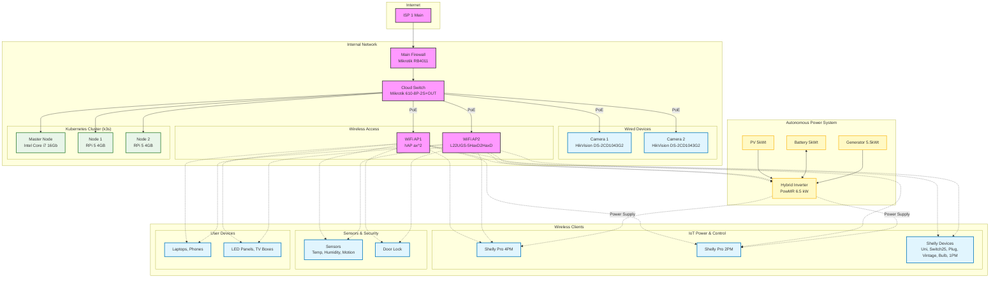

# Smart Office / Home office structure and services

```mermaid
graph TD
    %% Styles
    classDef network fill:#f9f,stroke:#333,stroke-width:2px;
    classDef device fill:#e1f5fe,stroke:#0277bd,stroke-width:2px;
    classDef power fill:#fff9c4,stroke:#fbc02d,stroke-width:2px;
    classDef server fill:#e8f5e9,stroke:#2e7d32,stroke-width:2px;

    subgraph Internet
        ISP[ISP 1 Main]:::network
    end

    subgraph "Internal Network"
        FW[Main Firewall<br/>Mikrotik RB4011]:::network
        SW[Cloud Switch<br/>Mikrotik 610-8P-2S+OUT]:::network
        
        subgraph "Wired Devices"
            Cam1[Camera 1<br/>HikVision DS-2CD1043G2]:::device
            Cam2[Camera 2<br/>HikVision DS-2CD1043G2]:::device
        end

        subgraph "Wireless Access"
            AP1[WiFi AP1<br/>hAP ax^2]:::network
            AP2[WiFi AP2<br/>L22UGS-5HaxD2HaxD]:::network
        end
        
        subgraph "Kubernetes Cluster (k3s)"
            Master[Master Node<br/>Intel Core i7 16Gb]:::server
            Node1[Node 1<br/>RPi 5 4GB]:::server
            Node2[Node 2<br/>RPi 5 4GB]:::server
        end
    end

    subgraph "Wireless Clients"
        subgraph "IoT Power & Control"
            ShellyPro4[Shelly Pro 4PM]:::device
            ShellyPro2[Shelly Pro 2PM]:::device
            ShellyMisc[Shelly Devices<br/>Uni, Switch25, Plug, Vintage, Bulb, 1PM]:::device
        end

        subgraph "Sensors & Security"
            Sensors[Sensors<br/>Temp, Humidity, Motion]:::device
            Lock[Door Lock]:::device
        end
        
        subgraph "User Devices"
            Users[Laptops, Phones]:::device
            Media[LED Panels, TV Boxes]:::device
        end
    end

    subgraph "Autonomous Power System"
        Inverter[Hybrid Inverter<br/>PowMR 6.5 kW]:::power
        PV[PV 5kWt]:::power
        Bat[Battery 5kWt]:::power
        Gen[Generator 5.5kWt]:::power
    end

    %% Connections
    ISP --> FW
    FW --> SW
    SW -->|PoE| Cam1
    SW -->|PoE| Cam2
    SW -->|PoE| AP1
    SW -->|PoE| AP2
    SW --> Master
    SW --> Node1
    SW --> Node2

    %% Wireless Links
    AP1 -.-> ShellyPro4
    AP1 -.-> ShellyPro2
    AP1 -.-> ShellyMisc
    AP1 -.-> Sensors
    AP1 -.-> Lock
    AP1 -.-> Users
    AP1 -.-> Media
    AP1 -.-> Inverter

    AP2 -.-> ShellyPro4
    AP2 -.-> ShellyPro2
    AP2 -.-> ShellyMisc
    AP2 -.-> Sensors
    AP2 -.-> Lock
    AP2 -.-> Users
    AP2 -.-> Media
    AP2 -.-> Inverter

    %% Power System Logic
    PV --> Inverter
    Bat <--> Inverter
    Gen --> Inverter
    Inverter -.->|Power Supply| ShellyPro4
    Inverter -.->|Power Supply| ShellyPro2
```
