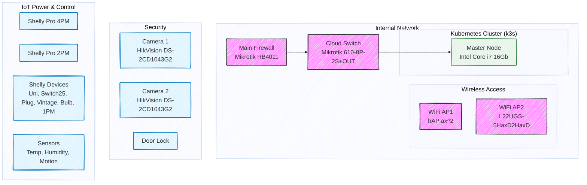

## High level diagram (data source segmentation)

### - network infrastructure with entry level information (i.e. internet connection, ip addresse, device name, etc)
### - IoT devices provide power control information, user activities, energy consumption and user real time events
### - Security device provides foto/video content, AI models metadata (human and vichle activities detection events, initial recognition of objects, and real time metadata)
### - Smart home/office datacenter provice journals and metrics data.

## Detailed schema

